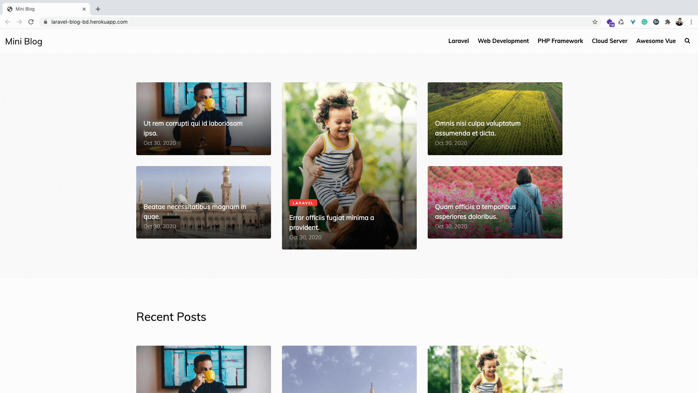

#### Frontend Screenshot


#### Backend Screenshot


#### Setup Project
```bash
# clone the repo
git clone https://github.com/KyryloNikolaiev/Blogsite-Laravel.git

# install composer dependency
composer install

# create a environment file
cp .env.example .env

# set the Application key
php artisan key:generate

# comment database query in AppServiceProvider.php like this
// $categories = Category::take(5)->get();
// View::share('categories', $categories);

// $setting = Setting::first();
// View::share('setting', $setting);

# setup the database credentials and migrate database with seeders
php artisan migrate --seed

# enable the database query code in AppServiceProvider.php like this
$categories = Category::take(5)->get();
View::share('categories', $categories);

$setting = Setting::first();
View::share('setting', $setting);
```


